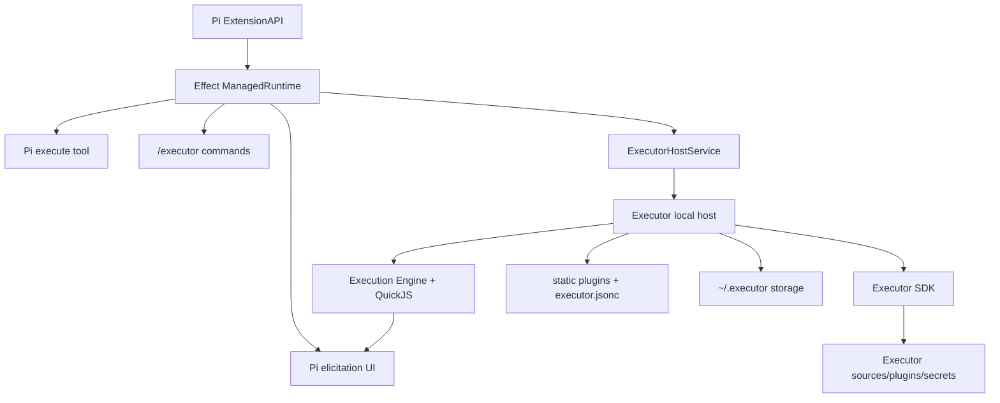

# pi-executor

`pi-executor` is a first-class Pi extension for running Executor from inside Pi
with native approval, elicitation, rendering, and project-aware Executor
configuration.

It is not a generic MCP adapter. Pi exposes a small Executor-specific surface,
while Executor remains responsible for tools, sources, secrets, policies,
plugins, and execution semantics.

## Features

### Executor-Native Execution

- Run Executor TypeScript snippets directly from Pi.
- Use Executor SDK semantics instead of shelling out to a daemon.
- Keep one primary `execute` tool instead of exposing many low-level tools.
- Use the active project cwd as the Executor scope.

### Local Executor Config Semantics

- Load Executor's static plugin defaults.
- Load project-level `executor.jsonc`.
- Preserve Executor plugin merge behavior.
- Use stable cwd-derived scope IDs.
- Reuse local Executor storage semantics.

### Pi-Native Elicitation

- Render approval prompts as Pi confirmations.
- Render form elicitation as Pi form UI or a structured editor fallback.
- Render URL elicitation with clear domain and action context.
- Treat accept, decline, and cancel as explicit outcomes.
- Fail loudly for unsupported elicitation shapes.

### Rich Rendering

- Syntax-highlight Executor code before execution.
- Render structured JSON cleanly.
- Separate summaries, logs, errors, and outputs.
- Show paused or elicitation states clearly.
- Keep large results readable inside Pi.

### Commands And Guidance

- Provide `/executor` status and diagnostics.
- Add focused settings and help commands for Executor workflows.
- Include Executor usage guidance for writing good Executor code from Pi.
- Avoid generic MCP search, describe, and invoke tool sprawl.

## Architecture



Pi owns the interaction surface. Executor owns execution, configuration, tools,
sources, secrets, and policy.

## Usage

Install the extension into Pi, then use the Executor tool from a project with
the desired `executor.jsonc` configuration.

```ts
await tools.executor.execute({
  code: `
    const tools = await executor.tools.list();
    return tools.map((tool) => tool.name);
  `,
});
```

Use `/executor` inside Pi to inspect extension status, active scope, loaded
configuration, and available diagnostics.

## Configuration

`pi-executor` follows Executor's local project configuration model:

- Project config: `executor.jsonc` in the active project.
- Storage: local Executor storage under `~/.executor`.
- Scope: derived from the active project cwd.
- Plugins: Executor defaults merged with project plugins.

Pi-specific settings only control the Pi extension experience, such as rendering
preferences and command behavior. Tool sources, secrets, policies, and plugin
configuration stay in Executor.

## Development

This package uses Bun, Effect v4, `tsgo`, `oxlint`, and `oxfmt`.

```bash
bun install
bun run typecheck
bun run lint
bun run format:check
```

Formatting:

```bash
bun run format
```

The TypeScript config is local to this package. There is no shared tsconfig
package.

Effect services use `Context.Service`, `Layer`, scoped resources, and typed
errors. Pi callbacks are thin Promise adapters around the Effect runtime.

## Non-Goals

- Building a generic MCP adapter for Pi.
- Running Executor's Bun server inside the extension.
- Serving Executor's React web UI from this package.
- Reimplementing Executor sources, plugins, secrets, or policy in Pi.
- Exposing every upstream MCP tool directly to the agent context.
